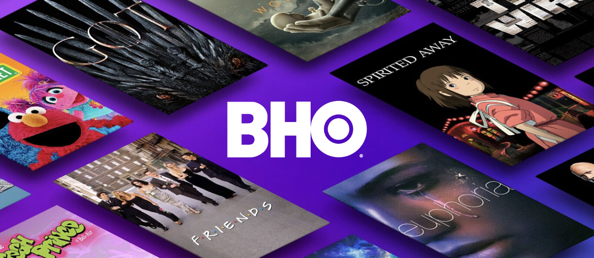

# Proyecto CinemExtract
Explorando el Séptimo Arte a través de Datos y Tecnología.

*Equipo de desarrollo*: 
Elena Águila, Vanesa Díaz, Valentina Fisher, Tania Graff y Franca Tortarolo.

## Resumen del Proyecto
Identificar las películas y cortos más populares de los años 2015 a 2020, basándonos en criterios como las calificaciones o los premios recibidos, con el objetivo de proporcionar recomendaciones específicas para la promoción del contenido más relevante dentro de la plataforma de streaming BHO.

## Fases del proyecto
El proyecto consta de 7 fases, que van desde la extracción de datos de diversas plataformas online utilizando diferentes técnicas de web scraping, hasta la creación de una BBDD propia donde se realizaron las consultas y el análisis de los datos extraídos. 

### Fase 1

En esta fase se utilizó la API de MovieDataSet para extraer información de peliculas y cortos entre los años 2015-2020.
 
    - Tipo (si es corto o película).

    - Nombre de la película o el corto.

    - Año de estreno de la película o corto.

    - Mes de estreno de la película o corto.

    - Id de la película (Identificativo de IMDB)

    - Género: Drama, Comedy, Action, Fantasy, Horror, Mystery, Romance, Thriller.

### Fase 2

En esta fase se obtuvo información más detallada sobre las peliculas y cortos extraidos durante la FASE 1. Utilizando Selenium como herramienta, se accedió a la siguiente información de la página web IMDB.

    - Puntuacion de IMDB (en caso de que la tenga).

    - Dirección (director/a o directore/as de cada película).

    - Guionistas (de cada película).

    - Argumento.

    - Duración (en minutos).

    - Nombre de la película.

### Fase 3 

En esta fase se obtuvo información detallada de los 10 principales actores de cada una de las peliculas extraidas durante la FASE 1 utilizando Selenium como herramienta. La información se obtuvo de la página web de IMDB.

    - Nombre

    - Año de nacimiento

    - ¿Por qué es conocido?

    - ¿Qué hace?

    - Premios

### Fase 4

En esta fase se trabajó con la biblioteca Beautiful Soup para extrar información de la tabla de los premios Oscars desde 2015 hasta 2020. La tabla fue extraída del siguiente link: [link_pagina](https://es.wikipedia.org/wiki/Premios_Óscar)
   
    - Fecha de la ceremonia

    - Mejor película

    - Mejor director

    - Mejor actor

    - Mejor actriz 

    
### Fase 5: 

En esta fase se pensó la estructura de una Base de Datos donde se almacenó toda la información recopilada, a través de tablas conectadas entre sí.

### Fase 6: 

En esta fase se insertaron todos los datos en la Base de Datos diseñada durante la FASE 5.

### Fase 7:

En esta útlima fase se realizaron consultas SQL para recuperar información específica y responder a las siguientes preguntas:

    - ¿Qué géneros han recibido más premios Óscar?

    - ¿Qué género es el mejor valorado en IMDB?

    - ¿En qué año se estrenaron más películas?

    - ¿En qué año se estrenaron mas cortos?

    - ¿Cuál es la mejor serie valorada en IMDB?

    - ¿Cuál es la película mejor valorada en IMDB?

    - ¿Qué actor/actriz ha recibido más premios?

    - ¿Hay algun actor/actriz que haya recibido más de un premio Óscar?

    - Encontrar películas con ciertas calificaciones
    
    - Encontrar películas dirigidas por un director en particular

    - Obtener una lista de películas fanadoras de un premio Oscar en una categoría específica

Por último, se elaboraron las conclusiones que han permitido al equipo proporcionar recomendaciones específicas para la promoción de contenido en la plataforma BHO.